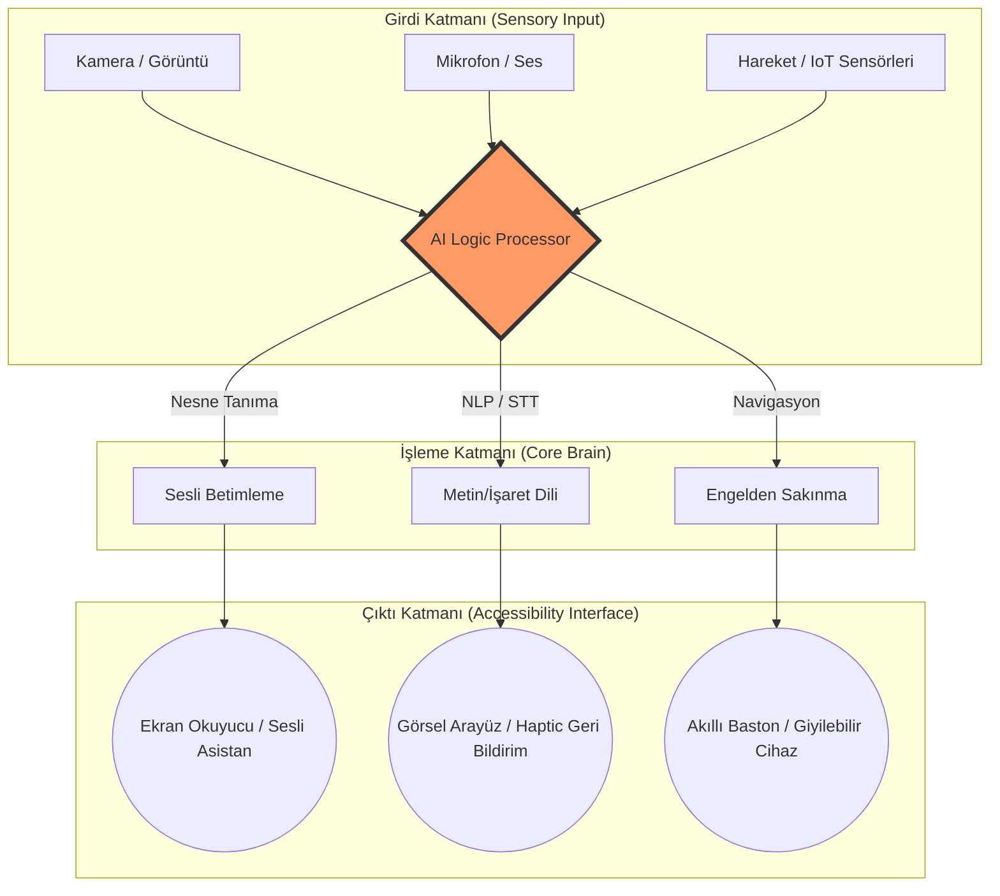

# ♿ BarrierFree-Architect: Engelsiz Yaşam Teknolojileri Rehberi

**BarrierFree-Architect**, engelli bireylerin sosyal hayata, eğitime ve istihdama katılımını kolaylaştıran teknolojik çözümler için tasarlanmış bir "Master Architecture" ve uygulama rehberidir. Bu repo, erişilebilirliği bir lütuf değil, bir mühendislik standardı olarak konumlandırır.

---

## 🎯 Vizyon ve Misyon
> *"Mükemmel bir sistem, herkesin hiçbir yardım almadan kullanabildiği sistemdir."*

Bu çalışma, TEKNOFEST 2025 Engelsiz Yaşam Teknolojileri kategorisinde, karmaşık bilişim mimarilerinin engelli bireylerin hayatını nasıl dönüştürebileceğine dair bir yol haritası sunar. Hedefimiz, "Herkes İçin Tasarım" (Design for All) prensiplerini en uç teknolojik sınırlarla birleştirmektir.

---

## 👨‍💻 Hazırlayan Hakkında
### **Bahattin Yunus Çetin**
**IT Architect Candidate | Technology Enthusiast**

Trabzon/Of'ta akademik yolculuğuna devam eden, yazılım mimarilerini insani değerlerle dokumayı amaçlayan bir vizyoner. "Engelsiz bir dünya" hayali, kod satırlarının ötesinde, yaşayan bir sistem tasarımıdır.

*   **📍 Location:** Trabzon, Türkiye
*   **🔗 LinkedIn:** [linkedin.com/in/bahattinyunus](https://www.linkedin.com/in/bahattinyunus/)
*   **📂 GitHub:** [github.com/bahattinyunus](https://github.com/bahattinyunus)

---

## 🏗️ Sistem Mimarisi (Accessibility Architecture)

Aşağıdaki diyagram, engelsiz yaşam teknolojilerinin katmanlı yapısını ve veri akışını temsil eder:

---

## 🚀 Teknolojik Derinlik

### 1. Algılama Katmanı (Perception Layer)
*   **Görüntü İşleme (Computer Vision):** YOLOv8 ve TensorFlow tabanlı modellerle gerçek zamanlı nesne tanıma (Object Detection). Görme engelliler için çevre analizi.
*   **Ses Tanıma & Dönüştürme:** Whisper AI gibi yüksek doğluklu modellerle fısıltı seviyesindeki konuşmaları dahi anlık metne dönüştürme.
*   **Sensör Füzyonu:** LiDAR ve ultrasonik sensörlerin verilerini birleştirerek milimetrik doğrulukta mesafe ölçümü.

### 2. İletişim ve Veri İşleme (Processing Layer)
*   **Edge Computing:** Verinin buluta gitmeden cihaz üzerinde (on-device) işlenmesi sayesinde sıfır gecikme (zero latency).
*   **Cloud Integration:** Büyük veri analitiği ve model güncellemeleri için AWS/Azure hibrit bulut yapıları.
*   **Güvenlik:** Kişisel verilerin korunması için uçtan uca şifreleme ve anonimleştirme protokolleri.

### 3. Kullanıcı Arayüzü (Interface Layer)
*   **WCAG 2.2 Standartları:** AAA seviyesinde erişilebilirlik uyumluluğu.
*   **Haptic Interface:** Görme engelliler için titreşim tabanlı (mors kodu/ritmik) geri bildirim sistemleri.
*   **BCI (Brain-Computer Interface):** İleri derece fiziksel engelliler için zihin kontrolü arayüzleri tasarımı.

---

## 🛠️ Araç Seti (The Tech Stack)
| Alan | Teknoloji |
| :--- | :--- |
| **Dil** | Python, C++, TypeScript |
| **AI/ML** | PyTorch, MediaPipe, OpenCV |
| **IoT** | ESP32, Raspberry Pi, LoRaWAN |
| **Mobil** | Flutter (Erişilebilir Widget Seti) |
| **Veritabanı**| PostgreSQL, Cassandra |

---

## 📜 Lisans & Telif
Bu proje, "Engelsiz Bir Dünya" mottosuyla geliştirilmiştir.
© 2025 Bahattin Yunus Çetin. Tüm hakları saklıdır.

---

*“En büyük engel, tasarlanmamış teknolojidir.”*
